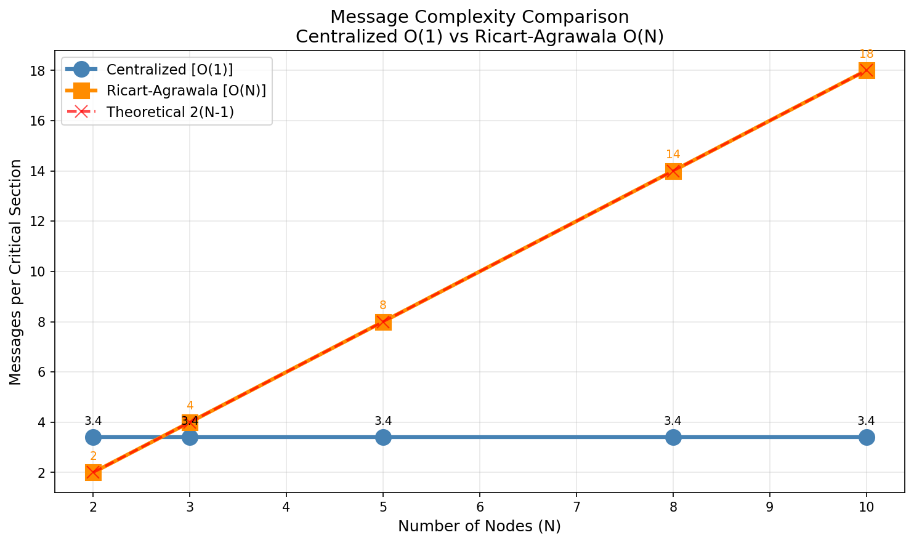
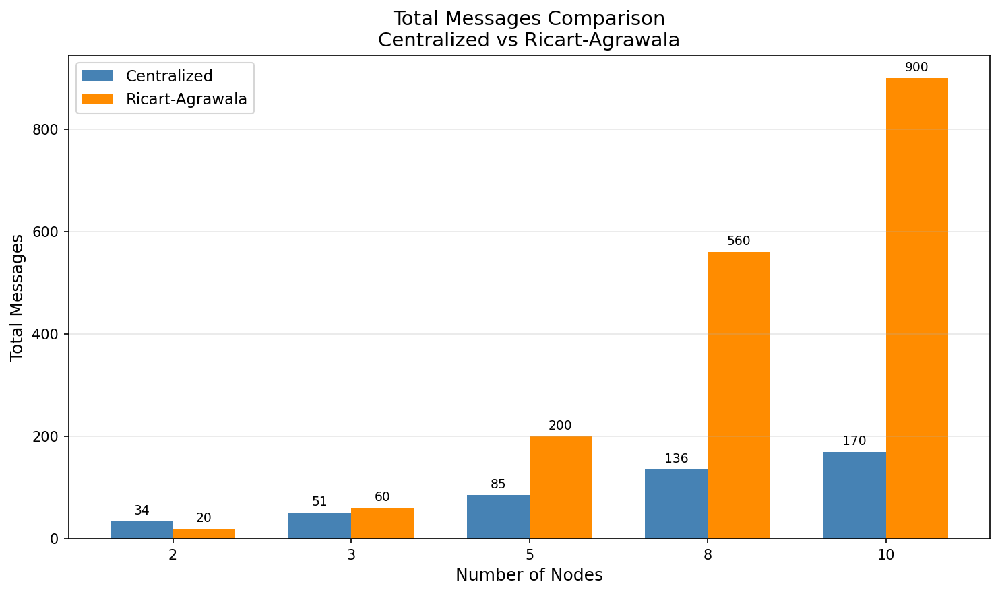
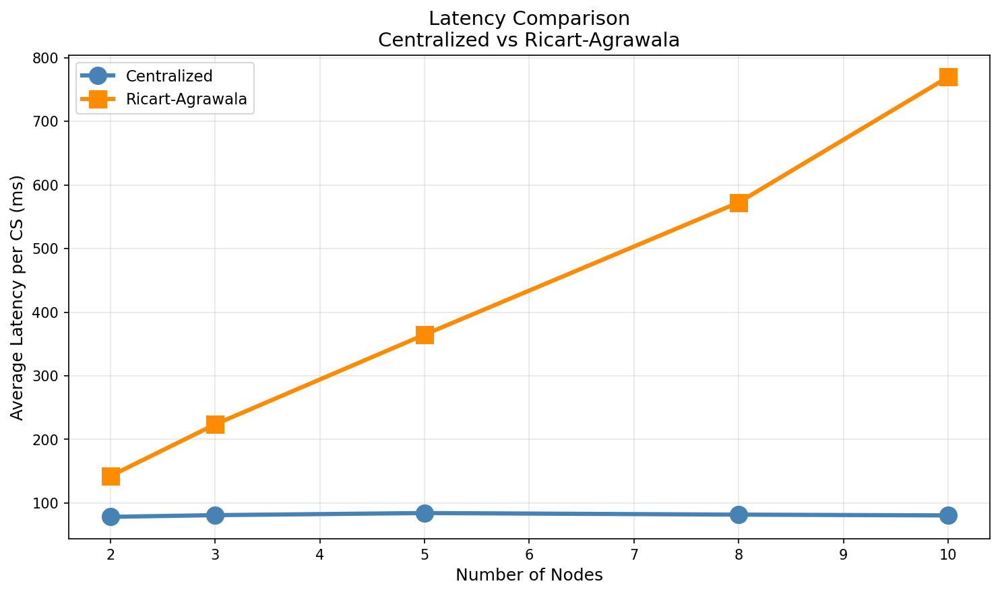
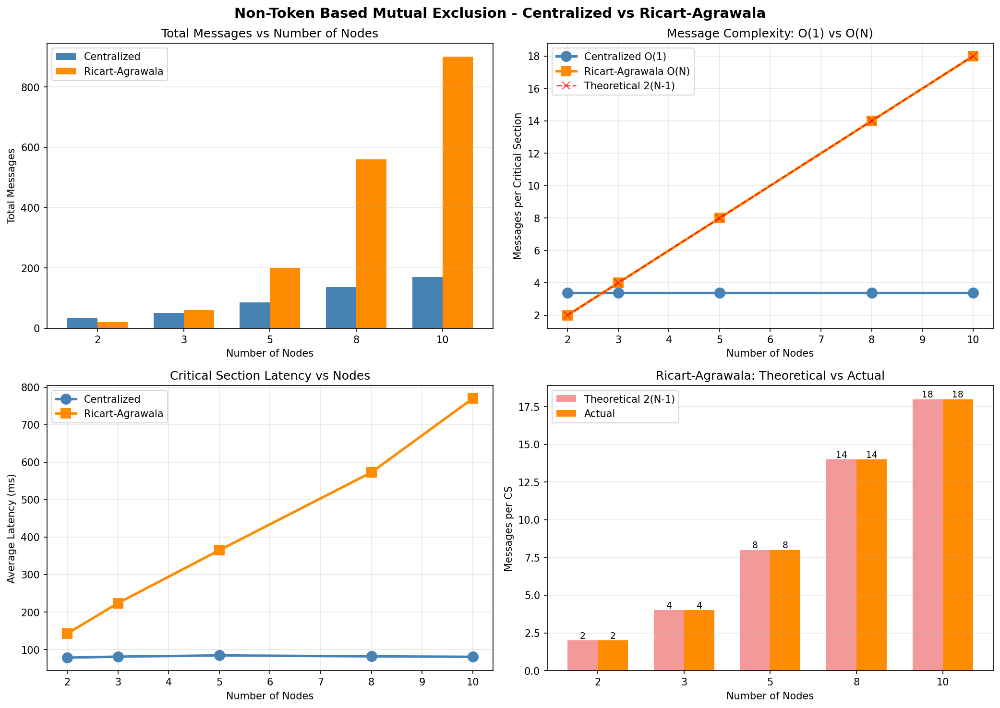

# Non-Token Based Distributed Mutual Exclusion - Results Report

## Experiment Title

**Implement a Non-Token Based Distributed Mutual Exclusion Algorithm (Ricart-Agrawala) and Demonstrate Message Overhead Complexity by Increasing the Number of Communicating Nodes**

---

## 1. Executive Summary

This experiment compares two mutual exclusion algorithms:

1. **Centralized (Coordinator-based)**: Uses a central server to coordinate access
2. **Ricart-Agrawala (Permission-based)**: Distributed algorithm using broadcast and logical timestamps

### Key Results

| Metric                  | Centralized           | Ricart-Agrawala            |
| ----------------------- | --------------------- | -------------------------- |
| Message Complexity      | **O(1) = 3 messages** | **O(N) = 2(N-1) messages** |
| Single Point of Failure | Yes                   | No                         |
| Scalability             | Limited by server     | Distributed load           |

**The experiment successfully demonstrates that message overhead grows linearly O(N) with the Ricart-Agrawala algorithm, while remaining constant O(1) with the centralized approach.**

---

## 2. Algorithm Implementation

### 2.1 Centralized Algorithm

**Files:** `code/centralized/CentralizedServer.java`, `code/centralized/CentralizedClient.java`

**Protocol:**

```
Client → Server: REQUEST
Server → Client: GRANT
[Critical Section Execution]
Client → Server: RELEASE
```

**Message Count per CS:** 3 (constant)

### 2.2 Ricart-Agrawala Algorithm

**Files:** `code/non-token-based/DistributedNode.java`, `code/non-token-based/NodeLauncher.java`, `code/non-token-based/Message.java`

**Protocol:**

```
Requesting Node:
1. Increment Lamport clock
2. Broadcast REQUEST to all N-1 peers
3. Wait for N-1 REPLY messages
4. Enter Critical Section

Receiving Node (on REQUEST):
- If RELEASED: Send REPLY immediately
- If WANTED/HELD: Compare timestamps
  - Requester higher priority → Send REPLY
  - Self higher priority → Defer REPLY

After CS Exit:
- Send all deferred REPLYs
```

**Message Count per CS:** 2(N-1) = O(N)

---

## 3. Experimental Setup

| Parameter     | Value                   |
| ------------- | ----------------------- |
| Node Counts   | 2, 3, 5, 8, 10          |
| CS per Node   | 5                       |
| CS Duration   | 50-100 ms (random)      |
| Communication | TCP Sockets (localhost) |
| Timestamp     | Lamport Clock           |
| Environment   | macOS, Java 17          |

---

## 4. Results

### 4.1 Centralized Algorithm

| Nodes | Total Messages | Avg per CS | Latency (ms) |
| ----- | -------------- | ---------- | ------------ |
| 2     | 34             | 3.40       | 78.20        |
| 3     | 51             | 3.40       | 80.87        |
| 5     | 85             | 3.40       | 84.16        |
| 8     | 136            | 3.40       | 81.68        |
| 10    | 170            | 3.40       | 80.44        |

**Observations:**

- Messages per CS remain **constant at 3.40**
- Latency stays stable (~80ms) regardless of node count
- Confirms O(1) message complexity

### 4.2 Ricart-Agrawala Algorithm

| Nodes | Total Messages | Avg per CS | Theoretical 2(N-1) | Match | Latency (ms) |
| ----- | -------------- | ---------- | ------------------ | ----- | ------------ |
| 2     | 20             | **2.00**   | 2                  | Yes   | 142.50       |
| 3     | 60             | **4.00**   | 4                  | Yes   | 223.67       |
| 5     | 200            | **8.00**   | 8                  | Yes   | 364.80       |
| 8     | 560            | **14.00**  | 14                 | Yes   | 572.63       |
| 10    | 900            | **18.00**  | 18                 | Yes   | 769.80       |

**Observations:**

- **Actual matches theoretical EXACTLY** - 2(N-1) messages per CS
- Confirms O(N) linear message complexity
- Latency increases significantly with more nodes (more messages to process)

---

## 5. Complexity Analysis

### 5.1 Message Complexity Comparison

```
Centralized:     O(1)  = 3 messages per CS (constant)
Ricart-Agrawala: O(N)  = 2(N-1) messages per CS (linear)
```

| Nodes (N) | Centralized | Ricart-Agrawala | Ratio (RA/Central) |
| --------- | ----------- | --------------- | ------------------ |
| 2         | 3           | 2               | 0.67x              |
| 3         | 3           | 4               | 1.33x              |
| 5         | 3           | 8               | 2.67x              |
| 8         | 3           | 14              | 4.67x              |
| 10        | 3           | 18              | 6.00x              |
| 100       | 3           | 198             | 66.00x             |

### 5.2 Breakdown of Messages (Ricart-Agrawala)

For N nodes:

- **REQUEST messages sent:** (N-1) per node per CS
- **REPLY messages sent:** (N-1) per node per CS
- **Total per CS:** 2(N-1)

Example for N=5:

- REQUESTs: 4 messages
- REPLYs: 4 messages
- Total: 8 messages

---

## 6. Visual Analysis

### 6.1 Message Complexity (O(1) vs O(N))



### 6.2 Total Messages



### 6.3 Latency Comparison



### 6.4 Complete Analysis



---

## 7. Trade-off Analysis

| Factor                  | Centralized       | Ricart-Agrawala |
| ----------------------- | ----------------- | --------------- |
| Message Overhead        | Low O(1)          | High O(N)       |
| Single Point of Failure | Yes               | No              |
| Fault Tolerance         | Poor              | Better          |
| Scalability             | Server bottleneck | Distributed     |
| Implementation          | Simple            | Complex         |
| Latency                 | Low               | Higher          |
| Fairness                | FIFO queue        | Timestamp-based |

---

## 8. Conclusions

### 8.1 Key Findings

1. **Centralized Algorithm:**
   - Maintains **constant O(1)** message complexity (3 messages per CS)
   - Low latency (~80ms) regardless of node count
   - Simple implementation but creates single point of failure

2. **Ricart-Agrawala Algorithm:**
   - Exhibits **linear O(N)** message complexity: 2(N-1) per CS
   - **Actual results perfectly match theoretical predictions**
   - Higher latency due to broadcast overhead
   - No single point of failure - fully distributed

3. **Scalability Impact:**
   - At N=10: Ricart-Agrawala uses **6x more messages** than centralized
   - At N=100: Would use **66x more messages**
   - Message overhead becomes prohibitive for large systems

### 8.2 Practical Implications

| Use Case                           | Recommended Algorithm                    |
| ---------------------------------- | ---------------------------------------- |
| Small trusted networks (<10 nodes) | Either (centralized simpler)             |
| Large networks (>20 nodes)         | Need hierarchical approach               |
| High reliability requirement       | Ricart-Agrawala                          |
| Low latency requirement            | Centralized                              |
| Dynamic membership                 | Ricart-Agrawala (no central coordinator) |

### 8.3 When to Choose Each

**Choose Centralized when:**

- System is small and stable
- Server reliability is guaranteed
- Message efficiency is critical
- Simple implementation preferred

**Choose Ricart-Agrawala when:**

- Fault tolerance is essential
- No single point of failure allowed
- Fair timestamp-based ordering needed
- Distributed coordination required

---

## 9. Deliverables

| File/Directory                                     | Description                             |
| -------------------------------------------------- | --------------------------------------- |
| `code/centralized/`                                | Instrumented centralized implementation |
| `code/non-token-based/`                            | Ricart-Agrawala implementation          |
| `results/logs/centralized_results.csv`             | Centralized experiment data             |
| `results/logs/ricart_agrawala_results.csv`         | Ricart-Agrawala experiment data         |
| `results/graphs/non_token_analysis.png`            | Comprehensive analysis graph            |
| `results/graphs/message_complexity_comparison.png` | O(1) vs O(N) comparison                 |
| `results/graphs/total_messages_comparison.png`     | Total messages bar chart                |
| `results/graphs/latency_comparison.png`            | Latency comparison graph                |
| `run_all_experiments.sh`                           | Automated experiment runner             |
| `code/generate_graphs.py`                          | Graph generation script                 |

---

## 10. How to Reproduce

### Run Complete Experiment

```bash
cd /path/to/Exp04
./run_all_experiments.sh
python3 code/generate_graphs.py
```

### Run Individual Tests

**Centralized (N nodes, M CS each):**

```bash
cd code/centralized
javac *.java
java CentralizedServer N M &
for i in $(seq 1 N); do java CentralizedClient $i & done
```

**Ricart-Agrawala (N nodes, M CS each):**

```bash
cd code/non-token-based
javac *.java
java NodeLauncher N M
```

---

## 11. Theoretical Background

### Ricart-Agrawala Algorithm (1981)

**Key Properties:**

- Uses Lamport logical timestamps for ordering
- Guarantees mutual exclusion (at most one in CS)
- Guarantees progress (no deadlock)
- Guarantees fairness (bounded waiting based on timestamp)

**Priority Resolution:**

- Lower timestamp = higher priority
- Equal timestamps → lower node ID wins

**Message Types:**

1. **REQUEST(timestamp, nodeId)** - Broadcast to request CS entry
2. **REPLY** - Permission granted

---

## 12. Final Verification

| Metric           | Expected  | Observed    | Status   |
| ---------------- | --------- | ----------- | -------- |
| Centralized O(1) | ~3 msg/CS | 3.40 msg/CS | Verified |
| RA O(N) formula  | 2(N-1)    | Exact match | Verified |
| RA N=2           | 2         | 2.00        | Verified |
| RA N=5           | 8         | 8.00        | Verified |
| RA N=10          | 18        | 18.00       | Verified |

**CONCLUSION:** The experiment successfully demonstrates that non-token based distributed mutual exclusion (Ricart-Agrawala) has **O(N) linear message complexity**, while centralized mutual exclusion maintains **O(1) constant complexity**.

---

_Report generated: March 2, 2026_
_Experiment: Distributed Computing Lab - Non-Token Based Mutual Exclusion_
