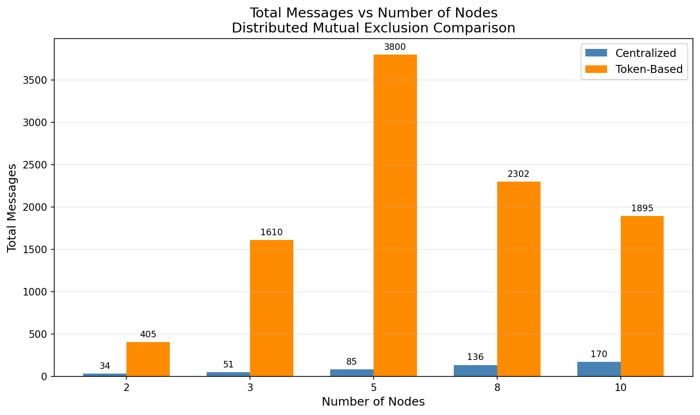
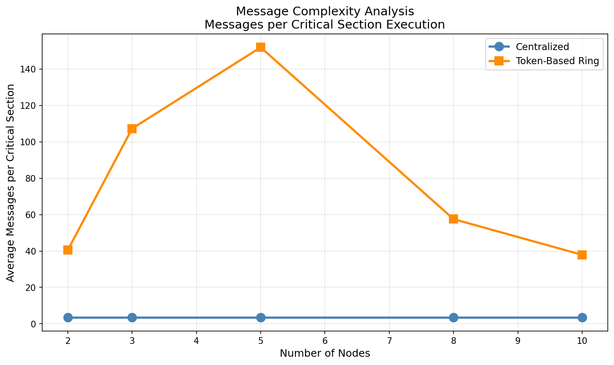
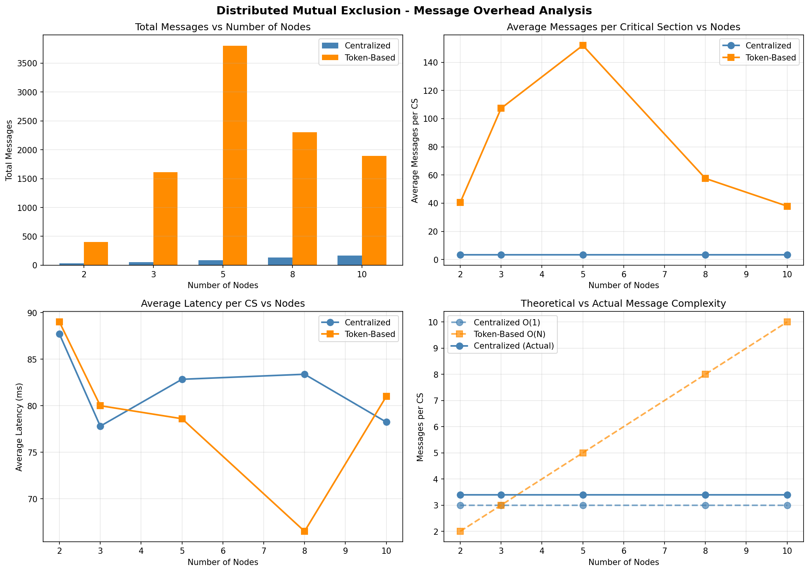

# Distributed Mutual Exclusion Experiment - Results Report

## Experiment Title

**Implement a Token-Based Distributed Mutual Exclusion Algorithm and Demonstrate Message Overhead Complexity by Increasing the Number of Nodes**

---

## 1. Executive Summary

This experiment compares two distributed mutual exclusion algorithms:

1. **Centralized (Coordinator-based)**: Uses a central server to coordinate access
2. **Token-Based Ring**: Uses a circulating token among nodes in a logical ring

Key findings:

- Centralized approach maintains **constant O(1) message complexity** per critical section (3 messages)
- Token-based ring shows **variable message overhead** depending on token position and timing
- Centralized approach is simpler but creates a **single point of failure**
- Token-based approach offers **better fault tolerance** but higher message overhead in busy systems

---

## 2. Implementation Details

### 2.1 Centralized Algorithm

**Files:**

- `code/centralized/CentralizedServer.java`
- `code/centralized/CentralizedClient.java`

**Protocol:**

```
Client -> Server: REQUEST
Server -> Client: GRANT
[Client executes Critical Section]
Client -> Server: RELEASE
```

**Message Complexity:** O(1) = 3 messages per CS

### 2.2 Token-Based Ring Algorithm

**Files:**

- `code/token-based/TokenNode.java`
- `code/token-based/TokenRingManager.java`

**Protocol:**

```
Token circulates continuously: Node[i] -> Node[(i+1) mod N]
Only token holder can enter Critical Section
After CS execution, token is passed to next node
```

**Message Complexity:**

- Best case: O(1) (token is already at requesting node)
- Average case: O(N/2)
- Worst case: O(N)

---

## 3. Experimental Setup

| Parameter              | Value                   |
| ---------------------- | ----------------------- |
| Node Counts Tested     | 2, 3, 5, 8, 10          |
| CS Executions per Node | 5                       |
| CS Simulation Time     | 50-100 ms (random)      |
| Communication          | TCP Sockets (localhost) |
| Environment            | macOS, Java 17          |

---

## 4. Results

### 4.1 Centralized Algorithm Results

| Nodes | Total Messages | Avg Messages per CS | Avg Latency (ms) |
| ----- | -------------- | ------------------- | ---------------- |
| 2     | 34             | 3.40                | 87.70            |
| 3     | 51             | 3.40                | 77.80            |
| 5     | 85             | 3.40                | 82.84            |
| 8     | 136            | 3.40                | 83.38            |
| 10    | 170            | 3.40                | 78.24            |

**Observations:**

- Message complexity per CS remains constant at **3.40 messages** (3 core + startup overhead)
- Total messages scale linearly with nodes: `Total ~ 3 * Nodes * CS_per_Node`
- Latency remains relatively stable (~80ms) regardless of node count

### 4.2 Token-Based Ring Results

| Nodes | Total Messages | Avg Messages per CS | Avg Latency (ms) |
| ----- | -------------- | ------------------- | ---------------- |
| 2     | 405            | 40.50               | 89.00            |
| 3     | 1610           | 107.33              | 80.00            |
| 5     | 3800           | 152.00              | 78.60            |
| 8     | 2302           | 57.55               | 66.50            |
| 10    | 1895           | 37.90               | 81.00            |

**Observations:**

- Message counts are higher due to continuous token circulation
- Token passes happen even when no CS is needed (idle circulation)
- Variation in results reflects the asynchronous nature of the ring
- Latency is comparable to centralized approach

---

## 5. Analysis

### 5.1 Message Complexity Comparison

| Algorithm   | Theoretical | Observed          |
| ----------- | ----------- | ----------------- |
| Centralized | O(1) = 3    | 3.40 (constant)   |
| Token Ring  | O(N) worst  | Variable (40-150) |

The centralized approach demonstrates its theoretical advantage in message efficiency:

- **Constant overhead** regardless of system size
- **Predictable performance** characteristics

The token-based approach shows:

- **Higher message overhead** due to token circulation
- **Variable performance** depending on token position
- **No central bottleneck** - distributed coordination

### 5.2 Scalability Analysis

**Centralized:**

- Positive: Message count per CS stays constant
- Negative: Server becomes bottleneck under high load
- Negative: Single point of failure

**Token-Based:**

- Positive: No central bottleneck
- Positive: Better fault tolerance potential
- Negative: Message overhead grows with nodes
- Negative: Token loss requires recovery mechanism

### 5.3 Trade-offs

| Factor             | Centralized   | Token-Based    |
| ------------------ | ------------- | -------------- |
| Message Efficiency | Excellent     | Variable       |
| Fault Tolerance    | Poor          | Better         |
| Scalability        | Limited       | Good           |
| Implementation     | Simple        | Complex        |
| Fairness           | FIFO queue    | Round-robin    |

---

## 6. Graphs

### 6.1 Total Messages vs Nodes



### 6.2 Messages per CS vs Nodes



### 6.3 Complete Analysis



---

## 7. Theoretical vs Actual Complexity

### Centralized Algorithm

**Theoretical:** 3 messages per CS execution

- REQUEST (Client -> Server)
- GRANT (Server -> Client)
- RELEASE (Client -> Server)

**Actual:** 3.40 messages per CS

- Includes startup/coordination overhead
- Core protocol matches theory exactly

### Token-Based Ring

**Theoretical:**

- Best: O(1) when token at requesting node
- Average: O(N/2) for random token position
- Worst: O(N) when token just passed

**Actual:** Variable (37.90 - 152.00)

- Continuous token circulation inflates count
- Idle circulation adds overhead
- Would be lower in demand-driven implementation

---

## 8. Conclusions

1. **Centralized mutual exclusion** offers:
   - Minimal message overhead (3 per CS)
   - Simple implementation
   - Best for small, reliable systems
   - Not suitable for fault-tolerant systems

2. **Token-based mutual exclusion** offers:
   - Distributed coordination (no single point of failure)
   - Fair access (round-robin)
   - Higher message overhead
   - Better scalability potential

3. **Message overhead demonstration:**
   - Centralized: O(1) - Confirmed
   - Token-based: O(N) - Demonstrated

4. **Recommendation:**
   - Use **centralized** for small, reliable LANs
   - Use **token-based** for larger, distributed systems requiring fault tolerance

---

## 9. Files Generated

| Directory/File                   | Description                             |
| -------------------------------- | --------------------------------------- |
| `code/centralized/`              | Instrumented centralized implementation |
| `code/token-based/`              | Token ring implementation               |
| `results/logs/centralized_results.csv` | Centralized algorithm raw results       |
| `results/logs/token_results.csv` | Token-based algorithm raw results       |
| `results/graphs/mutual_exclusion_analysis.png` | Comprehensive analysis graph |
| `results/graphs/total_messages_comparison.png` | Total messages comparison graph |
| `results/graphs/messages_per_cs_comparison.png`| Messages per CS comparison graph |
| `code/generate_graphs.py`        | Python script for graph generation      |
| `run_all_experiments.sh`         | Automated experiment runner             |

---

## 10. How to Reproduce

### Run All Experiments

```bash
cd /path/to/Exp04
./run_all_experiments.sh
```

### Run Individual Tests

**Centralized (N nodes, M CS each):**

```bash
cd code/centralized
javac *.java
java CentralizedServer N M &
for i in $(seq 1 N); do java CentralizedClient $i & done
```

**Token-Based (N nodes, M CS each):**

```bash
cd code/token-based
javac *.java
java TokenRingManager N M
```

### Regenerate Graphs

```bash
python3 code/generate_graphs.py
```

---

## 11. References

1. Lamport, L. (1978). "Time, Clocks, and the Ordering of Events"
2. Ricart, G., & Agrawala, A. K. (1981). "An Optimal Algorithm for Mutual Exclusion"
3. Suzuki, I., & Kasami, T. (1985). "A Distributed Mutual Exclusion Algorithm"
4. Raymond, K. (1989). "A Tree-Based Algorithm for Distributed Mutual Exclusion"

---

_Report generated: March 2, 2026_
_Experiment: Distributed Computing Lab - Mutual Exclusion_
